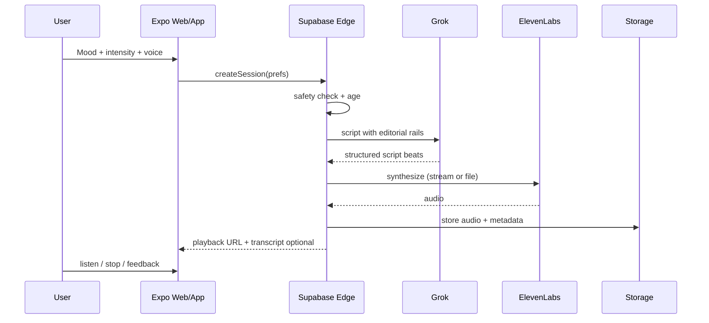

# Tech architecture (preliminary — awaiting cloud agent merge)

## Goals
Maintainable by a small team; fast iteration; adult-content-capable providers; privacy-aware.

## Recommended stack (v1 proposal)

| Layer | Choice | Why |
|-------|--------|-----|
| Client | **Expo (RN) + web** | One codebase; web MVP first; iOS later; matches maintainability goal |
| Backend | **Supabase** | Auth, DB, edge functions, storage for audio; low ops |
| LLM | **xAI Grok** (primary) | Consensual adult content; founder-validated spicy quality |
| TTS | **ElevenLabs** | Best intimate/expressive quality; original voices (no celebrity clone) |
| Payments | **Stripe** (web) | Avoid App Store IAP until/unless native soft shell |
| Hosting | **Expo web / Netlify or Vercel** | Simple |

## Session pipeline



## Editorial rails (critical)
System prompt + JSON schema enforcing:
- Settle → Want → Build → Peak(optional) → Aftercare
- Intensity ceiling
- Banned topics
- Max duration / word count
- No breaking character as "AI"

## Cost controls
- Max generative sessions / billing period
- Replay of past audio free
- "Shorter / continue" cheaper than full regen
- Cache voice settings
- Prefer turbo TTS only if quality A/B passes

## Privacy
- Encrypt preference JSON at rest
- Signed URLs for audio; TTL
- Delete user → cascade wipe audio + prefs
- Minimal analytics (no prompt logging in third-party analytics)

## Safety
- Age gate server-side
- Output classifier / keyword + LLM judge
- Report button → quarantine flag
- Rate limits

## Monorepo sketch
```
/apps/mobile          # Expo app (web + ios)
/packages/shared      # types, prompt templates
/supabase/functions   # generate-session, feedback
/docs                 # research + product
```

## Build sequence (tasks, not calendar)
1. Docs + prompt rails + safety policy
2. Supabase schema (users, profiles, sessions, feedback)
3. `generate-session` edge function (mock TTS OK first)
4. Expo web player UI (mood → listen)
5. Wire ElevenLabs
6. Auth + session history
7. Stripe stub + caps
8. Closed women-tester loop

## Open decisions for agent merge
- Native SwiftUI vs Expo (lean Expo)
- Pre-generate full file vs stream TTS
- Single signature voice vs cast of 3
