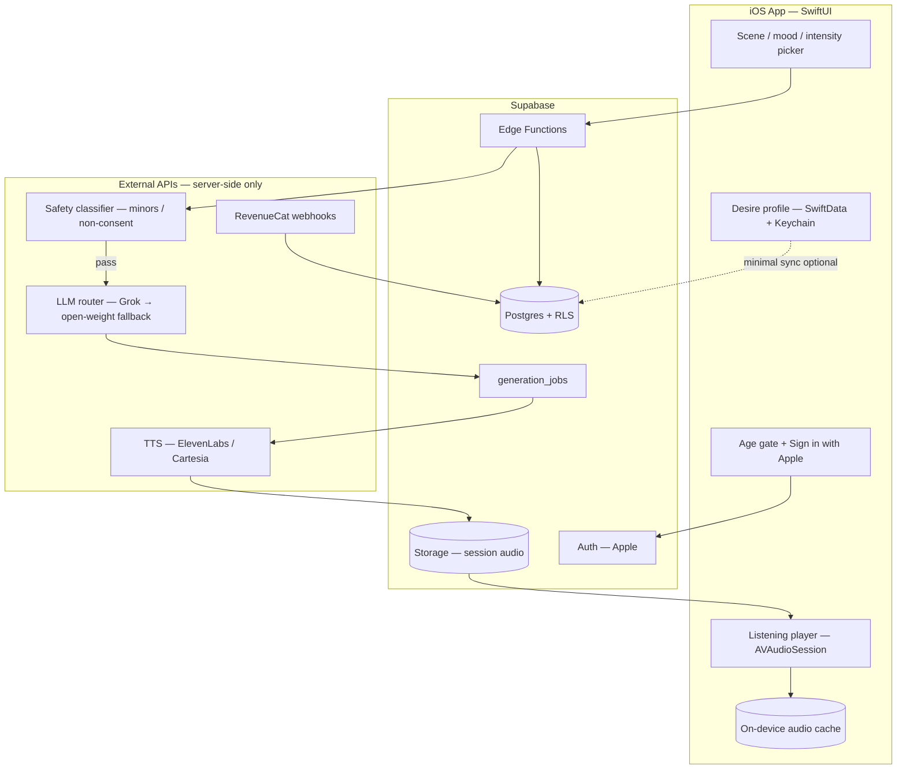

# Selfish — Tech Architecture (MVP)

Working name: **Selfish** — AI + TTS ASMR desire-listening for iOS.  
Audience: women-first. Thesis to prove: **voice immersion > text chat**.  
Principle: boring, maintainable tech. No overengineering.

*Research date: 2026-08-14. Re-verify vendor AUPs and pricing before contracts.*

---

## 1. Executive recommendation

| Layer | Choice | Why |
| --- | --- | --- |
| Client | **Native SwiftUI (iOS 17+)** | Single platform, best audio/session UX, fewer moving parts for solo/small team |
| Backend | **Supabase** (Auth + Postgres + Storage + Edge Functions) | One BaaS for auth, prefs, jobs, audio files; SQL + RLS; portable |
| Billing | **RevenueCat + StoreKit 2** | Boring subscription gating; webhooks → Supabase entitlements |
| LLM (desire) | **Primary: xAI Grok API** · **Fallback: hosted open-weight (abliterated) via OpenAI-compatible API** | Major-lab option most workable for consensual adult erotic *text*; open-weight when refused |
| LLM (calm) | Same Grok stack *or* cheaper mid-tier model | Calm mode has no erotic policy risk |
| TTS | **Primary: ElevenLabs** (quality) · **Cost/latency alt: Cartesia** · **Offline/privacy: Apple AVSpeech (calm only)** | ASMR whisper quality is the product; confirm commercial sensual use in writing |
| Session audio | **Pre-generate + cache** (not live conversational streaming) | Simpler, cacheable, cheaper, better for continuous listening |
| Privacy | **Local-first desire profile**; server stores hashed/minimal prefs + session metadata | Intimate data stays on device where possible |

---

## 2. Architecture diagram



**Request path (happy case)**

1. User completes age gate → Sign in with Apple → short desire onboarding (stored mostly on device).
2. User picks mood (Desire / Focus), scene template, intensity 1–5, length (5 / 10 / 15 min).
3. App calls Supabase Edge Function with **sanitized preference tokens** (not free-text diary).
4. Edge Function: entitlement check → safety filter → LLM script → TTS → upload audio → return signed URL + script id.
5. Player streams/downloads audio, supports pause, soft fade-stop, pace (±10%), intensity not mid-session (next session only for MVP).

---

## 3. Stack decision table

| Decision | Options considered | Winner | Reject / defer reason |
| --- | --- | --- | --- |
| Client | SwiftUI · Expo/RN · Flutter | **SwiftUI** | iOS-primary; ASMR needs reliable background audio, Now Playing, AirPods routing, low-latency local cache. RN/Expo adds audio edge cases + dual toolchain for one OS. Revisit Expo only if Android is forced within ~1 quarter of PMF. |
| Backend | Supabase · Firebase · CF Workers-only · Vercel+Postgres | **Supabase** | Auth + relational prefs/sessions + Storage + Edge Functions in one bill. Firebase wins push/Crashlytics but NoSQL + lock-in is worse for session/job modeling. Pure Workers needs you to assemble DB/auth. Vercel is web-centric. |
| Jobs | Edge Function sync · Queue (Inngest/QStash) · always-on worker | **Edge Function + `generation_jobs` table** | MVP sessions ≤15 min script; generate in one request with timeout budget, or write `pending` + poll. Add a queue only when timeouts/rate limits hurt. |
| LLM desire | Grok · Claude · OpenAI · self-host OSS | **Grok primary + OSS fallback** | See §4. Claude prohibits erotic content. OpenAI adult mode shelved; sexual outputs unreliable for product thesis. Self-host GPU is ops-heavy for MVP — use *hosted* open-weight API first. |
| TTS | ElevenLabs · Cartesia · Apple · OpenAI TTS | **ElevenLabs** | Best whisper/intimate quality for the “voice > text” thesis. Cartesia for cheaper/faster streaming experiments. Apple insufficient for premium ASMR. |
| Audio strategy | Live stream TTS · Pre-generate full session · Chunk pipeline | **Pre-generate full session** | Cache hits, simpler player, predictable cost. Optional: generate in 2–3 chunks for faster time-to-first-audio without full duplex chat. |
| Billing | StoreKit-only · Stripe · RevenueCat | **RevenueCat** | Entitlements + paywall UI + webhooks with minimal code. |
| Analytics | Full product suite · Privacy-light | **TelemetryDeck or similar** (or none in week 1) | Avoid shipping intimate preference payloads to analytics. |

---

## 4. LLM policy comparison (adult consensual erotic *text*)

Policies move; treat this as a build-time risk matrix, not legal advice. Always keep **your own** hard bans regardless of vendor.

| Provider | Consensual adult erotic fiction | Hard stops (typical) | Fit for Selfish |
| --- | --- | --- | --- |
| **Anthropic Claude** | **Prohibited** — “Do Not Generate Sexually Explicit Content” (sex acts, fetishes/fantasies, erotic chats) | Minors, CSAM, etc. | **Do not use for Desire mode.** Optional later for Focus copy only if split routing is worth it. |
| **OpenAI** | Unreliable — adult/erotic ChatGPT mode **shelved indefinitely** (2026); API moderation still flags sexual content | Minors, non-consent, sexual/minors, etc. | **Not primary.** May work for mild romantic/Focus; will break spicy intensity dial. |
| **xAI Grok** | **Most workable major-lab option for adult fictional text** — AUP emphasizes illegal harm, minors, real-person pornographic likenesses / NCII more than banning fictional adult erotica | Children/sexualization, real-person intimate likenesses, illegal content; enforcement can be inconsistent | **Primary for Desire scripts.** Validate with real prompts across intensity 1–5 before locking. Prefer `store: false` / no server retention where available. |
| **Open-weight (hosted)** e.g. Mistral/Qwen/Llama **abliterated** via Featherless / similar OpenAI-compatible hosts | Generally allows NSFW if you add your own policy layer | **You** must enforce minors/non-consent; vendor AUPs still ban illegal | **Fallback** when Grok refuses or quality drifts. Pick one host, one model (~24B–70B class), wrap with identical safety prefilter. |
| **Self-host GPU** | Full control | Ops, cost floor, compliance burden | **Post-MVP** if COGS or policy risk forces it. |

### Recommendation

- **Primary (Desire):** xAI Grok chat/completions (latest stable instruct model). System prompt: consent-forward, adult-only fiction, second-person intimate narration optimized for *spoken* ASMR (short clauses, breath pauses, no stage directions).
- **Fallback (Desire):** Hosted open-weight abliterated model behind the same Edge Function router + **identical** safety classifier.
- **Focus/Relax:** Same primary model with a separate system prompt (no erotic content). No need for a second vendor in MVP.
- **Never:** Send raw free-text “tell me your darkest secret” to the model without classification. Use structured preference tokens + curated scene templates.

---

## 5. TTS comparison (ASMR / intimate whisper)

| Provider | Whisper / intimate quality | Latency | Cost shape (order of magnitude) | Policy notes | Role |
| --- | --- | --- | --- | --- | --- |
| **ElevenLabs** | **Best-in-class** breathy/whisper library; Multilingual v2/v3 for quality | ~250–300ms API; Flash ~75ms (less expressive) | API ≈ **$0.10 / 1K chars** (v2/v3) or **$0.05** (Flash/Turbo); ~1K chars ≈ 1 min speech rule-of-thumb | Official AUP hard-bans minors/exploitation; **get written OK for commercial sensual ASMR** before scale | **Primary quality path** |
| **Cartesia** | Good natural speech; weaker ASMR whisper pedigree vs ElevenLabs | **Best TTFA** (~40–200ms class) | Often **~$0.01–0.05 / 1K chars** depending on tier | Minors banned; broad “objectionable” discretion | Cost/latency alternative; A/B later |
| **Apple AVSpeech / on-device** | Robotic for intimacy; usable for Focus | Instant, offline | **$0** | On-device privacy win | Focus offline / airplane mode only — **not** for Desire MVP thesis |
| **OpenAI TTS** | Clean but not ASMR-whisper specialty | Good | Mid | Tied to OpenAI content rules | Skip for MVP |

### Streaming vs pre-generate

| Approach | Pros | Cons | MVP pick |
| --- | --- | --- | --- |
| Live conversational stream (LLM→TTS duplex) | Feels “alive” | Hard; expensive; safety mid-stream; weak caching | **Out** |
| Chunk pipeline (script sections → TTS sequentially) | Faster first audio | More player complexity | **Optional stretch** |
| **Full pre-generate** | Cache, simple player, predictable cost, full safety review of script before speech | Wait 10–40s before play | **In** |

**Per-session cost sketch (Desire, 10 min):**

- Script ≈ 1,200–1,800 words ≈ 7–11K characters of TTS input (spoken pacing is slower than audiobook).
- ElevenLabs v3 @ $0.10/1K ≈ **$0.70–$1.10 TTS** + LLM ≈ **$0.02–$0.15** → **~$0.80–$1.25 COGS** before cache.
- Cache hit on same scene+intensity+voice → near **$0** TTS.

---

## 6. Session UX architecture

```text
Age gate (18+) → Sign in with Apple
  → Desire profile (3–5 screens, skippable details)
  → Home: Desire | Focus
  → Scene picker (curated cards) + intensity dial + length
  → Generating (progress, cancel)
  → Player (continuous listen)
       controls: play/pause, 15s scrub, pace 0.9–1.1×, soft Stop (fade)
  → End: Save to library? · Adjust intensity · Report
```

**Onboarding desire profile (local-first)**

- Soft preferences only: tone (tender / teasing / commanding), pace, boundaries (hard “never” list), voice preference (1–2 voices in MVP), focus vs desire default.
- Store richly on device (SwiftData). Sync to server as **enum tokens** + intensity defaults — not prose journals.
- Explicit consent copy: fictional adult content, AI voice, not a real partner, stop anytime.

**Player requirements (native)**

- `AVAudioSession` category `.playback`, background audio mode, Lock Screen / Dynamic Island Now Playing.
- Gentle haptics optional; no bright UI — dim, one composition, large stop.
- Do not show full script by default (protects thesis); optional “show text” behind secondary affordance for accessibility.

---

## 7. Privacy

| Data | Where | Retention |
| --- | --- | --- |
| Age affirmation, account id | Supabase Auth | Account lifetime |
| Desire profile detail | **Device first** (Keychain for secrets, SwiftData for prefs) | User-controlled delete |
| Preference tokens used for generation | Postgres `profiles` (minimal) | Until account delete |
| Scripts | Postgres; optional omit body after TTS | 30-day default TTL |
| Audio | Supabase Storage + on-device cache | 7–30 day TTL; user delete |
| Safety flags / reports | Postgres | Longer retention for abuse |
| Analytics | Event names only (`session_started`, `intensity`) — **no** preference text | Aggregate |

**Practices**

- API keys only on server (Edge Functions).
- RLS: users read only own rows; Storage paths scoped by `auth.uid()`.
- No vendor training opt-in on intimate prompts where the API allows disable/store-off.
- Export/delete account = wipe profile tokens, jobs, audio, local store.

---

## 8. Safety

**Ship-blocking**

1. **Age gate** — 18+ affirmation before any Desire content; App Store age rating 17+; consider stronger age assurance later if store/regs require.
2. **Hard bans** (classifier + denylist before LLM, and post-check on script): minors (any), non-consent / coercion, incest involving minors, real-person impersonation, illegal acts. Refuse with calm copy; log incident id.
3. **Intensity dial** 1–5 with clear labels (e.g. Warm → Suggestive → Spicy → Explicit → Edge). Cap free tier at ≤2.
4. **Consent-forward system prompt** + curated scene templates (no open jailbreak chat in MVP).
5. **Report / block** on session end and in library; webhook to email/Notion for human review.
6. **Crisis / reality boundary** — one-liner in settings: not therapy; not a real relationship.

**Do not build in MVP:** open-ended erotic chatbot, user voice cloning of real people, social feed, share-to-TikTok of Desire audio.

---

## 9. Cost control

| Lever | Mechanism |
| --- | --- |
| Subscription | RevenueCat entitlements: `focus` free tier; `desire` paid |
| Quotas | Soft caps: e.g. free 3×5-min Focus/week; paid N Desire minutes/month |
| Session length | Only 5 / 10 / 15; no infinite listen-generation |
| Caching | Key: `user_segment + scene_id + intensity + voice_id + length` → reuse audio when possible; personalized intros as short prepend |
| Model routing | Cheap/short prompts; truncate scripts to spoken budget |
| TTS | Prefer cached; Flash model only if quality A/B passes |
| Generation debounce | One in-flight job per user; cancel abandons billable work early when possible |

---

## 10. MVP scope — ruthlessly cut

### In (smallest lovable product)

- iOS SwiftUI app, Sign in with Apple, 18+ gate  
- Desire mode + Focus mode  
- Curated scene picker (~8–12 scenes), intensity dial, length picker  
- One excellent feminine-presenting whisper voice (plus one Focus voice)  
- Script generation + ElevenLabs TTS + continuous player  
- Local desire profile + minimal server tokens  
- RevenueCat paywall (Desire gated)  
- Report button, hard-ban safety prefilter  
- Session library (last N sessions)  

### Out (post-MVP / later)

- Android, web, iPad-optimized layout  
- Open chat / multi-turn roleplay  
- Voice cloning of users or celebrities  
- Live duplex streaming “conversation”  
- Video, avatars, 3D, spatial audio experiments  
- Social, sharing, community  
- Many voices / marketplace  
- Fine-tuned custom LLM, self-hosted GPU  
- Complex personalization ML  
- Therapist / coaching claims  
- Push-heavy re-engagement on intimate content  

**Success metric for thesis:** unprompted retention and qualitative feedback that *listening* felt better than reading the same script.

---

## 11. Suggested monorepo folder structure

Keep one repo; avoid microservices.

```text
selfish/
├── apps/
│   └── ios/                      # Xcode project / Tuist optional later
│       ├── Selfish/
│       │   ├── App/
│       │   ├── Features/
│       │   │   ├── Onboarding/
│       │   │   ├── Home/
│       │   │   ├── ScenePicker/
│       │   │   ├── Player/
│       │   │   ├── Library/
│       │   │   └── Settings/
│       │   ├── Services/         # Auth, API, AudioSession, Cache
│       │   ├── Models/
│       │   └── Resources/
│       └── SelfishTests/
├── backend/
│   └── supabase/
│       ├── migrations/           # profiles, scenes, jobs, reports
│       ├── functions/
│       │   ├── generate-session/
│       │   ├── safety-check/
│       │   └── revenuecat-webhook/
│       └── seed/                 # scene templates
├── packages/
│   └── prompts/                  # versioned system prompts + scene YAML
│       ├── desire/
│       ├── focus/
│       └── safety/
├── docs/
│   └── research/
│       └── 03-tech-architecture.md
├── scripts/                      # seed voices, cost sims, prompt eval
└── README.md
```

No separate Nest/Next API in MVP — Edge Functions are enough.

---

## 12. First 2-week build plan (task sequencing only)

Order matters; no calendar-day estimates.

### Sequence A — Foundations

1. Create monorepo skeleton + empty SwiftUI app (iOS 17+, background audio capability).  
2. Stand up Supabase project: Auth (Apple), `profiles`, `scenes`, `generation_jobs`, `reports`, Storage bucket, RLS policies.  
3. Wire Sign in with Apple end-to-end; age gate screen before main shell.  
4. Seed 8–12 scene templates in DB + `packages/prompts`.  

### Sequence B — Generation path (prove voice thesis)

5. Implement `safety-check` (rules + lightweight classifier) with unit fixtures for banned prompts.  
6. Implement LLM router: Grok primary → open-weight fallback; Desire + Focus system prompts.  
7. Implement `generate-session`: entitlement stub → safety → LLM → persist script → ElevenLabs TTS → Storage → signed URL.  
8. Build Generating UI + Player (download/stream file, lock screen controls, fade stop, pace).  
9. Dogfood 10 Desire + 10 Focus sessions; fix whisper settings / SSML-like pause markup in scripts.  

### Sequence C — Product shell & money

10. Desire profile onboarding (local SwiftData) → emit preference tokens to generate API.  
11. Home + scene/mood/intensity/length picker wired to real generate.  
12. RevenueCat products + paywall; webhook writes `entitlement` on `profiles`; enforce in Edge Function.  
13. Quotas + cache key lookup before TTS.  
14. Report flow + account delete (server wipe + local wipe).  
15. TestFlight build; privacy nutrition labels draft; confirm ElevenLabs commercial sensual use in writing.  

**Exit criteria:** a stranger can age-gate, subscribe (sandbox), pick a scene, and listen to a full whispered session without opening a script view.

---

## 13. Cost sketch per active user / month

Assumptions (tune after metering):

- Paid Desire user: **12 sessions / month**, avg **10 min**, **40% cache hit** on scene+intensity  
- New TTS minutes ≈ 12 × 10 × 0.6 = **72 min** ≈ **72K chars**  
- ElevenLabs ≈ **$7.20** TTS  
- LLM ≈ 12 × $0.08 ≈ **$0.96**  
- Supabase / storage / bandwidth ≈ **$0.20–0.50**  
- **Variable COGS ≈ $8–9 / heavy Desire user / month** before cache improves  

| User type | Sessions | Cache | Est. variable COGS |
| --- | --- | --- | --- |
| Free Focus-only | 8 × 5 min, Apple TTS or cheap TTS | high | **~$0.10–0.50** |
| Light paid | 4 × 10 min Desire | 50% | **~$2–3** |
| Typical paid | 12 × 10 min | 40% | **~$8–9** |
| Power user | 30 × 15 min | 25% | **~$25–35** → must hard-cap minutes |

**Pricing implication:** Desire subscription should sit well above typical COGS (e.g. design for **≥3–5×** margin after Apple’s cut), with **minute caps** on lower tiers. Caching and scene reuse are not optional — they are the business model.

Fixed monthly (solo MVP): Supabase Pro ~$25, RevenueCat free tier until scale, domain/Apple Developer ~$99/yr, LLM/TTS prepaid credits as usage grows.

---

## 14. Risks & open actions

| Risk | Mitigation |
| --- | --- |
| Vendor AUP change (LLM or TTS) blocks Desire | Abstract router; keep OSS fallback warm; written policy confirmation |
| ElevenLabs quality ≠ commercial permission | Email sales/support **before** public launch; have Cartesia + commissioned human voice plan B |
| Grok refusals at high intensity | Prompt eval harness; fallback model; soften template rather than jailbreak |
| App Store review | Clear 17+ rating, age gate, no misleading “real person” claims, safety copy |
| COGS blowout | Minute caps, cache, pre-generate only, no duplex chat |
| Intimate data leak | Local-first prefs, RLS, no preference text in analytics |

---

## 15. One-page “boring stack” summary

**SwiftUI + Supabase + RevenueCat + Grok (OSS fallback) + ElevenLabs pre-generated audio.**

Build a listening product, not a chatbot platform. Cut everything that does not serve whispered, consent-forward, personalized sessions on iPhone.
